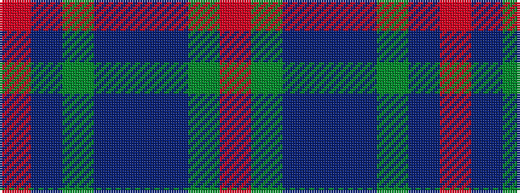

RBGBBBGR

It is a 8 stripe tartan.

<figure class="pat-woven">

<figcaption>idealised sample</figcaption>
</figure>

## Colour Sequence



## Tartans with this colour sequence

| Tartans |
|---------------|
| [Daks (Navy)](/variants/s8/r3g6db2dbi2db11g9db2r3~x2/)|
||
| [Daks, Navy](/variants/s8/r5g12dbi4db4dbi22g18dbi4r5/)|
||
