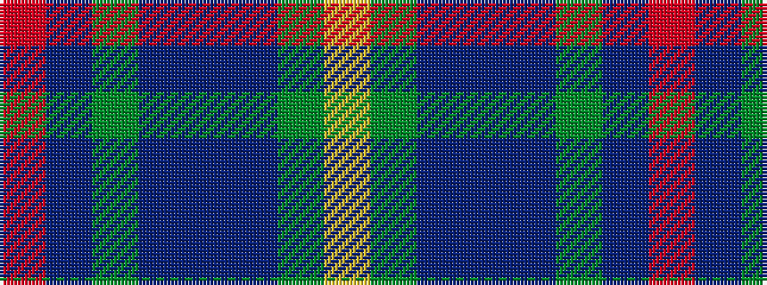

RBGBBBGY

It is a 8 stripe tartan.

<figure class="pat-woven">

<figcaption>idealised sample</figcaption>
</figure>

## Colour Sequence



## Tartans with this colour sequence

| Tartans |
|---------------|
| [Miller](/setts/s8/r2db6g15b9db30b9g6lo2~x2/)|
||
