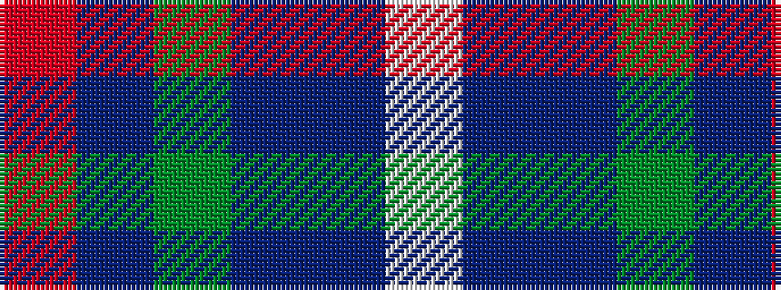

RBGBBW

It is a 6 stripe tartan.

<figure class="pat-woven">

<figcaption>idealised sample</figcaption>
</figure>

## Colour Sequence



## Tartans with this colour sequence

| Tartans |
|---------------|
| [Afternoon Tea / Black Tea](/setts/s6/m15dt8y25dt72n98w15/)|
||
