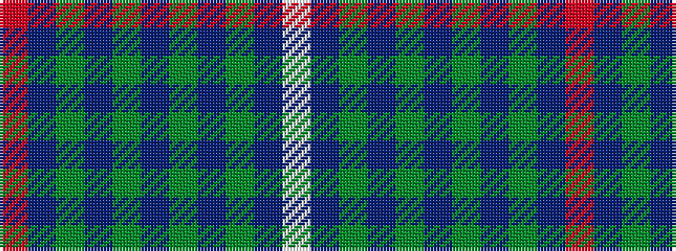

RBGBGBGBGBW

It is a 11 stripe tartan.

<figure class="pat-woven">

<figcaption>idealised sample</figcaption>
</figure>

## Colour Sequence



## Tartans with this colour sequence

| Tartans |
|---------------|
| [Solway Spirit (District)](/setts/s11/w4dp40g2dp2g2dp2g2dp3g16db15m3~x2/)|
||
