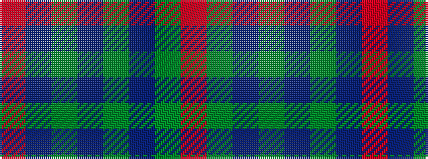

RBGBGBGR

It is a 8 stripe tartan.

<figure class="pat-woven">

<figcaption>idealised sample</figcaption>
</figure>

## Colour Sequence



## Tartans with this colour sequence

| Tartans |
|---------------|
| [Daks (0600150)](/variants/s8/r5dt12g3db4g20dt3g3r5~x4/)|
||
