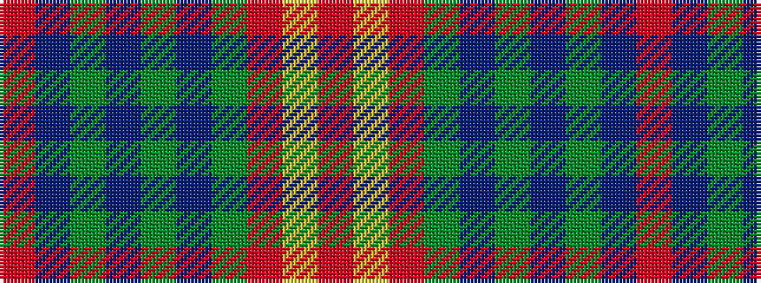

RBGBGBGRYR

It is a 10 stripe tartan.

<figure class="pat-woven">

<figcaption>idealised sample</figcaption>
</figure>

## Colour Sequence



## Tartans with this colour sequence

| Tartans |
|---------------|
| [MacEdward](/setts/s10/r12ly4r38g25db8g10db8g8db25r3/)|
||
| [MacEdward (Personal)](/setts/s10/r12ly4r38dg25db8dg10db8dg8db25r3/)|
||
