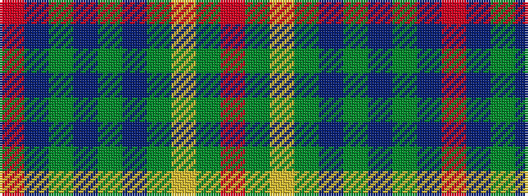

RBGBGBGYGR

It is a 10 stripe tartan.

<figure class="pat-woven">

<figcaption>idealised sample</figcaption>
</figure>

## Colour Sequence



## Tartans with this colour sequence

| Tartans |
|---------------|
| [Ayrton of Laoch (Personal)](/setts/s10/r2g12ly2g12db3g2db2g2db4r2~x2/)|
||
| [Ayrton, Laoch](/setts/s10/r1g6ly1g6db1g1db1g1db2r1~x4/)|
||
