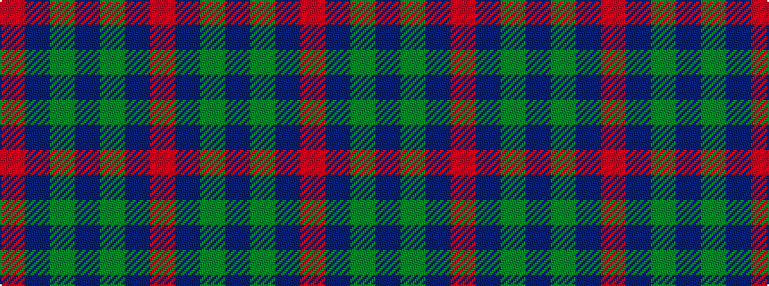

RBGBGBR

It is a 7 stripe tartan.

<figure class="pat-woven">

<figcaption>idealised sample</figcaption>
</figure>

## Colour Sequence



## Tartans with this colour sequence

| Tartans |
|---------------|
| [Tennant](/variants/s7/r1dr7g7db7g7db7r1~x4/)|
||
