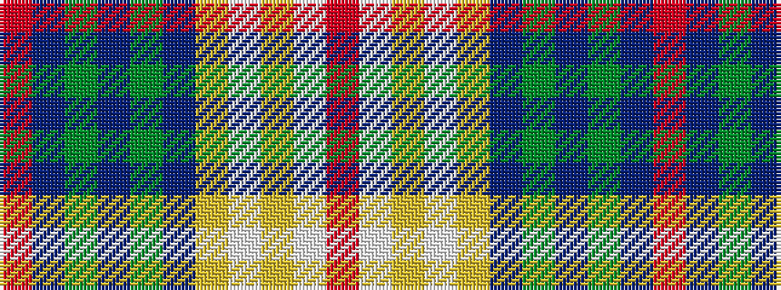

RBGBGBYWYWR

It is a 11 stripe tartan.

<figure class="pat-woven">

<figcaption>idealised sample</figcaption>
</figure>

## Colour Sequence



## Tartans with this colour sequence

| Tartans |
|---------------|
| [Canice-Moodie (Personal)](/variants/s11/r3db6g5db1g1db3ly6w6ly2w6r2~x2/)|
||
