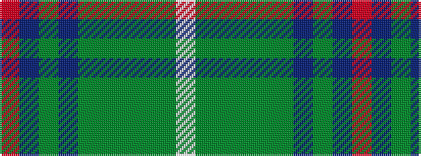

RBGBGGGGGW

It is a 10 stripe tartan.

<figure class="pat-woven">

<figcaption>idealised sample</figcaption>
</figure>

## Colour Sequence



## Tartans with this colour sequence

| Tartans |
|---------------|
| [Kinfauns Castle](/setts/s10/r4p12dg2p2dg24dg2dg2dg16dg2w1~x2/)|
||
