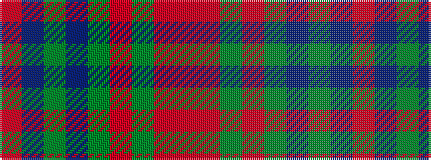

RBGBGRGRR

It is a 9 stripe tartan.

<figure class="pat-woven">

<figcaption>idealised sample</figcaption>
</figure>

## Colour Sequence



## Tartans with this colour sequence

| Tartans |
|---------------|
| [Scottish National Htg (Fashion)](/setts/s9/o66m3g3m3g16dr8g3dr3mi4~x2/)|
||
