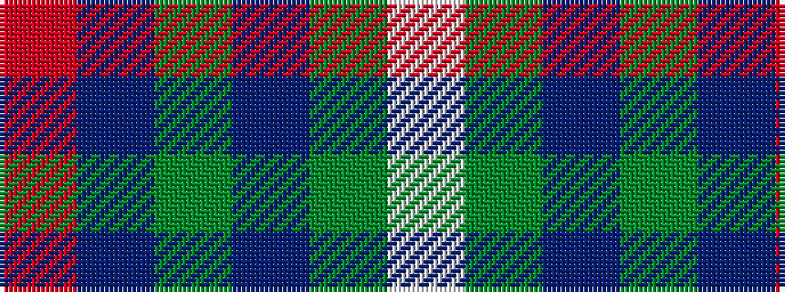

RBGBGW

It is a 6 stripe tartan.

<figure class="pat-woven">

<figcaption>idealised sample</figcaption>
</figure>

## Colour Sequence



## Tartans with this colour sequence

| Tartans |
|---------------|
| [Connacht Irish District Tartan](/variants/s6/r2db32g14db5g16w2~x2/)|
||
| [Connaught Green](/variants/s6/r1db12y5db2y4lb1~x2/)|
||
| [Deeside, Royal](/variants/s6/lp4dy2dp4dy35n27r3~x2/)|
||
| [Kinfauns Castle (Corporate)](/variants/s6/r4dp12g2dp2g46w1~x2/)|
||
