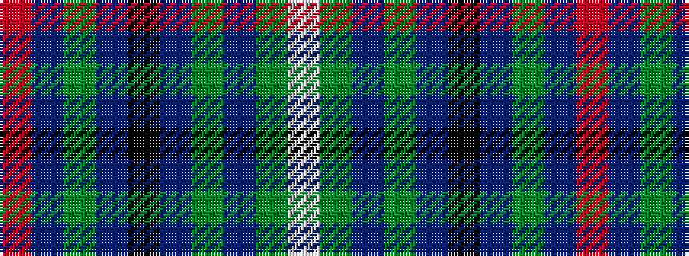

RBGBKBGBGW

It is a 10 stripe tartan.

<figure class="pat-woven">

<figcaption>idealised sample</figcaption>
</figure>

## Colour Sequence



## Tartans with this colour sequence

| Tartans |
|---------------|
| [Colgan, USA, Robert James](/variants/s10/r7db2g5db2k24db2g10db28g10w3~x2/)|
||
