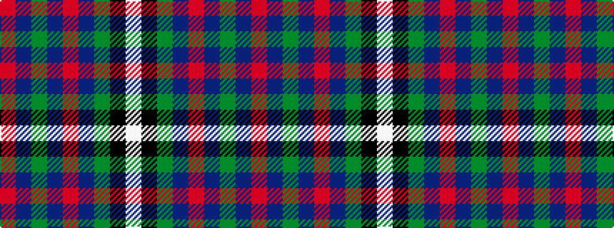

RBGBRBGKW

It is a 9 stripe tartan.

<figure class="pat-woven">

<figcaption>idealised sample</figcaption>
</figure>

## Colour Sequence



## Tartans with this colour sequence

| Tartans |
|---------------|
| [MacAulay](/variants/s9/r48db1g24db1r10db1g12k1w4~x2/)|
||
| [MacAulay (MacGregor)](/variants/s9/r96db1dg24db1r10db1dg12k1w4~x2/)|
||
| [MacAulay of Ardincaple (Clan)](/variants/s9/r50db3g6db1r3db1g8k1lb3~x2/)|
||
