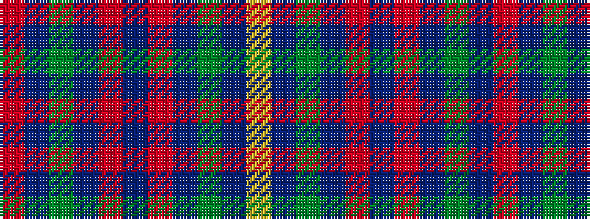

RBGBRBRBGBY

It is a 11 stripe tartan.

<figure class="pat-woven">

<figcaption>idealised sample</figcaption>
</figure>

## Colour Sequence



## Tartans with this colour sequence

| Tartans |
|---------------|
| [Clare](/variants/s11/m3db14gi14db2m14db2m14db2g14db2ly3~x2/)|
||
| [Clare Irish County Tartan](/variants/s11/r3db14g14db2r14db2r14db2g14db2lo3~x2/)|
||
