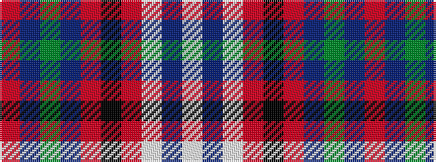

RBGBRKRWBW

It is a 10 stripe tartan.

<figure class="pat-woven">

<figcaption>idealised sample</figcaption>
</figure>

## Colour Sequence



## Tartans with this colour sequence

| Tartans |
|---------------|
| [Jaggy Thistle (Fashion)](/variants/s10/lp9n4lp5o4k3o12n18y4n18o6~x2/)|
||
