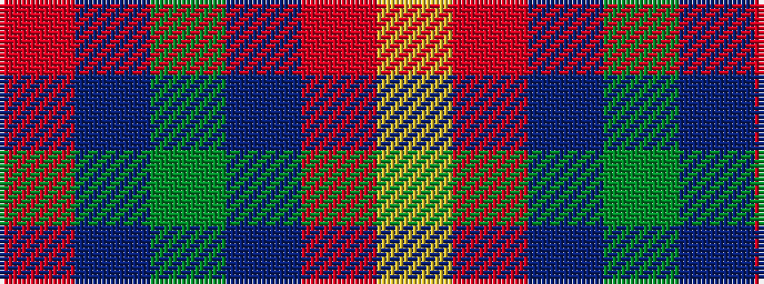

RBGBRY

It is a 6 stripe tartan.

<figure class="pat-woven">

<figcaption>idealised sample</figcaption>
</figure>

## Colour Sequence



## Tartans with this colour sequence

| Tartans |
|---------------|
| [Canine All Dogs](/variants/s6/r5t3g24db24r4ly2~x2/)|
||
| [Canine All Dogs (Fashion)](/variants/s6/r10db6g24dbi24r6ly3/)|
||
