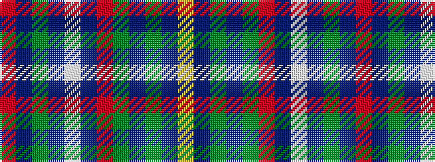

RBGBWBRGBGBY

It is a 12 stripe tartan.

<figure class="pat-woven">

<figcaption>idealised sample</figcaption>
</figure>

## Colour Sequence



## Tartans with this colour sequence

| Tartans |
|---------------|
| [Langholm Millennium](/variants/s12/ri43db3dy1db2w1db6r2g1db1g3db1ly3~x2/)|
||
