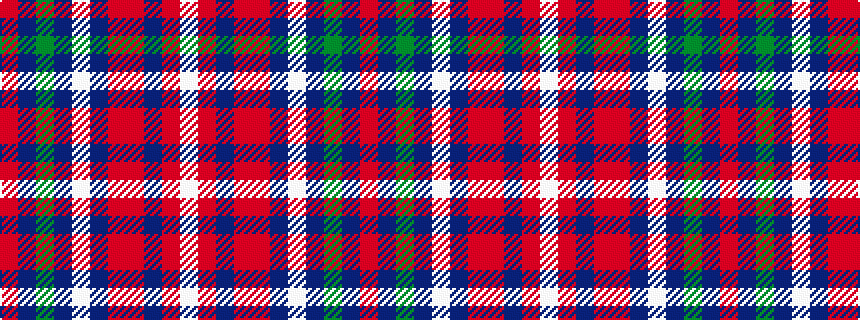

RBGBWBRRBRW

It is a 11 stripe tartan.

<figure class="pat-woven">

<figcaption>idealised sample</figcaption>
</figure>

## Colour Sequence



## Tartans with this colour sequence

| Tartans |
|---------------|
| [Cavalier, Red](/variants/s11/o40dt10y2dt2w2dt3r8o6dt2o4w2~x2/)|
||
