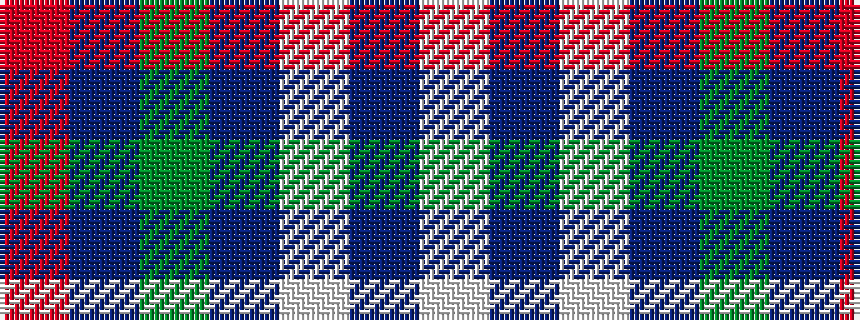

RBGBWBW

It is a 7 stripe tartan.

<figure class="pat-woven">

<figcaption>idealised sample</figcaption>
</figure>

## Colour Sequence



## Tartans with this colour sequence

| Tartans |
|---------------|
| [Gonzaga University’s True Blue and White](/setts/s7/w6db2w3db2g2db20r1~x2/)|
||
| [Ikelman #4 (Personal)](/setts/s7/r10db15g2db2w1db1w1~x4/)|
||
