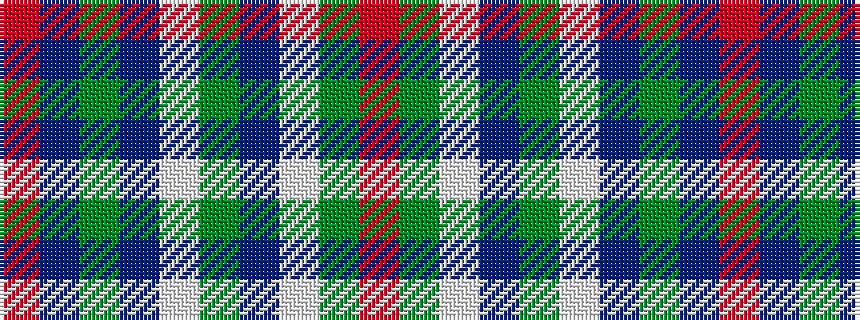

RBGBWGBWGR

It is a 10 stripe tartan.

<figure class="pat-woven">

<figcaption>idealised sample</figcaption>
</figure>

## Colour Sequence



## Tartans with this colour sequence

| Tartans |
|---------------|
| [Kerry County, Crest Range](/setts/s10/o14db5dg25db5w2dg11db7w5dg6o5~x2/)|
||
