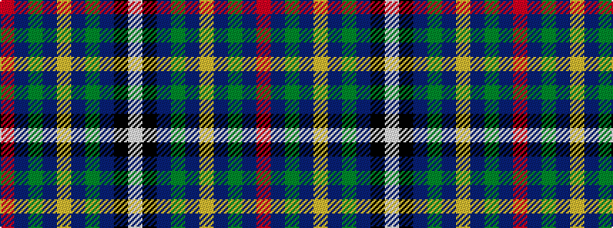

RBGBYBGBKW

It is a 10 stripe tartan.

<figure class="pat-woven">

<figcaption>idealised sample</figcaption>
</figure>

## Colour Sequence



## Tartans with this colour sequence

| Tartans |
|---------------|
| [Fogarty (Tipperary)](/variants/s10/r4b60g35b4ly4b4y12b18k3w2/)|
||
