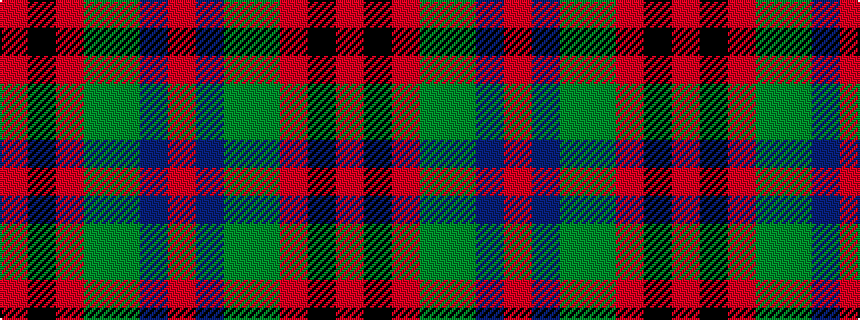

RBGGRKR

It is a 7 stripe tartan.

<figure class="pat-woven">

<figcaption>idealised sample</figcaption>
</figure>

## Colour Sequence



## Tartans with this colour sequence

| Tartans |
|---------------|
| [MacDuff](/setts/s7/r96db16dg34dgi48r18k6r9/)|
||
| [MacDuff](/setts/s7/r96db16dg34g48r18k6r9/)|
||
