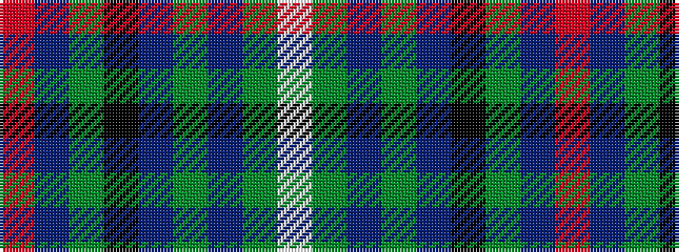

RBGKBGBGW

It is a 9 stripe tartan.

<figure class="pat-woven">

<figcaption>idealised sample</figcaption>
</figure>

## Colour Sequence



## Tartans with this colour sequence

| Tartans |
|---------------|
| [Colgan (Personal)](/setts/s9/r7db2g5k24db2g10db28g10lb3~x2/)|
||
