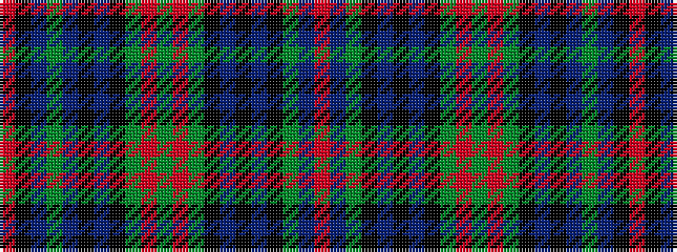

RBGKBKBKGRGRGKBKBGBKR

It is a 21 stripe tartan.

<figure class="pat-woven">

<figcaption>idealised sample</figcaption>
</figure>

## Colour Sequence



## Tartans with this colour sequence

| Tartans |
|---------------|
| [Wcwm 1538](/setts/s21/o3k2db2dg24db1k4db2k6dg6o2dg10o2dg6k6db2k4db1k24dg2db4o1~x4/)|
||
