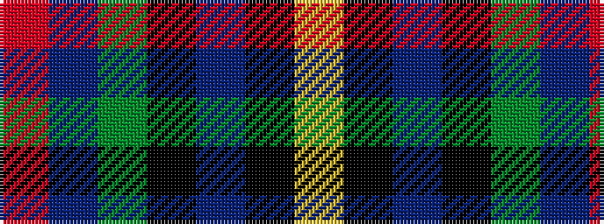

RBGKBKY

It is a 7 stripe tartan.

<figure class="pat-woven">

<figcaption>idealised sample</figcaption>
</figure>

## Colour Sequence



## Tartans with this colour sequence

| Tartans |
|---------------|
| [Gracey (2013)](/setts/s7/r3dp8g20k20db17k3lg3~x2/)|
||
