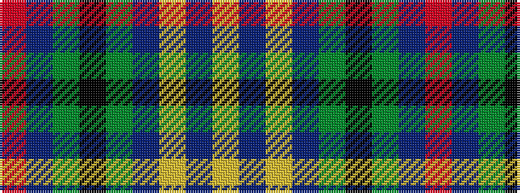

RBGKGBYBY

It is a 9 stripe tartan.

<figure class="pat-woven">

<figcaption>idealised sample</figcaption>
</figure>

## Colour Sequence



## Tartans with this colour sequence

| Tartans |
|---------------|
| [Pagus Wasia](/variants/s9/r1db2y1k3y19db3ly1db2ly1~x4/)|
||
