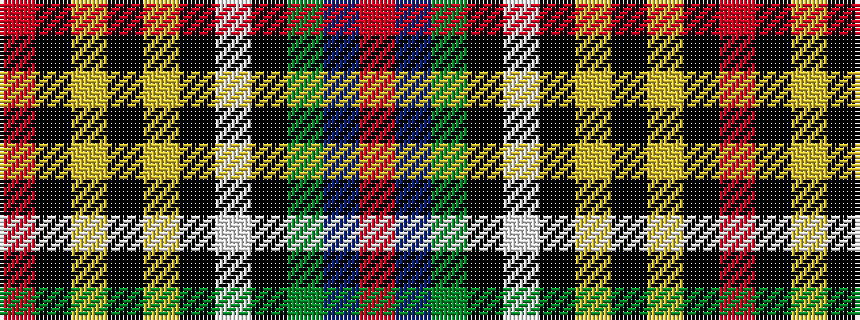

RBGKWKYKYKR

It is a 11 stripe tartan.

<figure class="pat-woven">

<figcaption>idealised sample</figcaption>
</figure>

## Colour Sequence



## Tartans with this colour sequence

| Tartans |
|---------------|
| [Hislop Hunting (Name)](/setts/s11/r2k8ly2k7ly1k1w3k2g9db8r2~x2/)|
||
| [Hislop/Hyslop Hunting #2](/setts/s11/r2k8ly2k7ly1k1w3k2dg9db8r2~x2/)|
||
