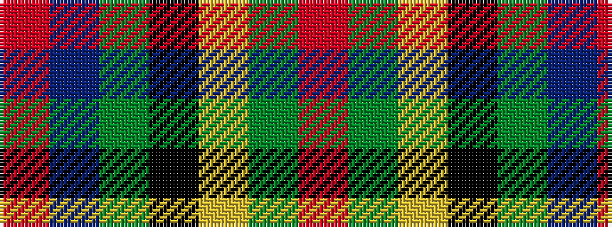

RBGKYGR

It is a 7 stripe tartan.

<figure class="pat-woven">

<figcaption>idealised sample</figcaption>
</figure>

## Colour Sequence



## Tartans with this colour sequence

| Tartans |
|---------------|
| [Brodie Hunting](/setts/s7/r2dg8ly1k8dg8db8r2/)|
||
