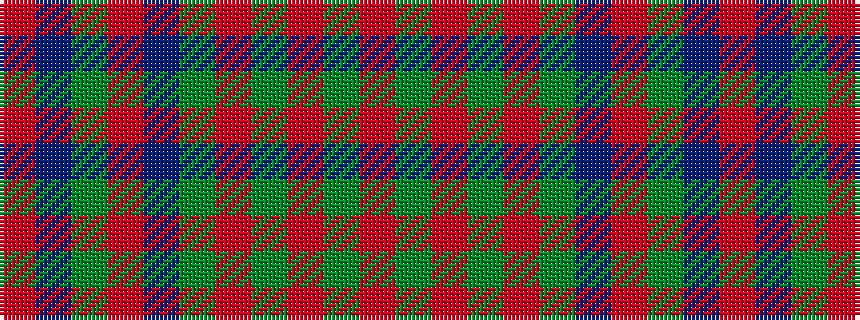

RBGRBGRGRGR

It is a 11 stripe tartan.

<figure class="pat-woven">

<figcaption>idealised sample</figcaption>
</figure>

## Colour Sequence



## Tartans with this colour sequence

| Tartans |
|---------------|
| [Bonnie Brae](/setts/s11/r6db3y3r26db20dg26o3dg4o3dg4o6/)|
||
