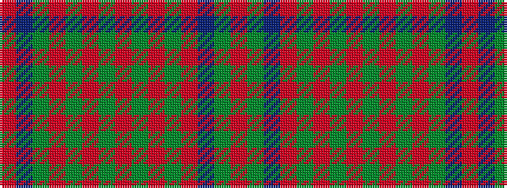

RBGRGRGRGRGRBGR

It is a 15 stripe tartan.

<figure class="pat-woven">

<figcaption>idealised sample</figcaption>
</figure>

## Colour Sequence



## Tartans with this colour sequence

| Tartans |
|---------------|
| [All Ireland Red](/setts/s15/r6y2db2r30g2r2g4r2g2r1g20r1y2db2r4~x2/)|
||
