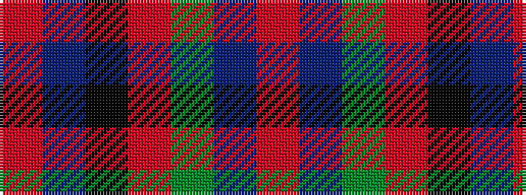

RBGRKBR

It is a 7 stripe tartan.

<figure class="pat-woven">

<figcaption>idealised sample</figcaption>
</figure>

## Colour Sequence



## Tartans with this colour sequence

| Tartans |
|---------------|
| [Stewart /Stuart- Fragment Cf 1452 & 1445](/setts/s7/r3t4k11r11g11do3r3~x4/)|
||
