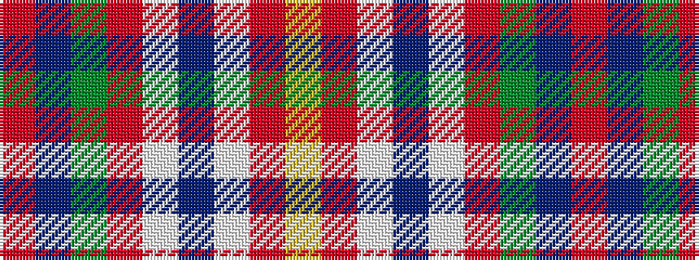

RBGRWBWRY

It is a 9 stripe tartan.

<figure class="pat-woven">

<figcaption>idealised sample</figcaption>
</figure>

## Colour Sequence



## Tartans with this colour sequence

| Tartans |
|---------------|
| [Brousseau (Personal)](/setts/s9/ly25o2w2db2w2o13dy28db2o3~x2/)|
||
