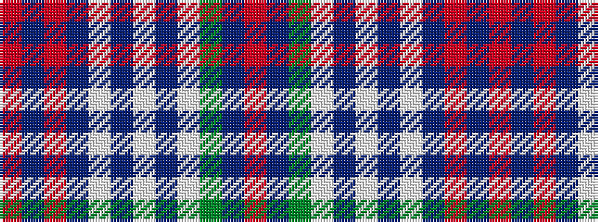

RBGWBWBWBRBR

It is a 12 stripe tartan.

<figure class="pat-woven">

<figcaption>idealised sample</figcaption>
</figure>

## Colour Sequence



## Tartans with this colour sequence

| Tartans |
|---------------|
| [Sunart, Saphire (Dance)](/variants/s12/r3db1ri20db20w2db2w2db2w32dg1db1r3~x2/)|
||
