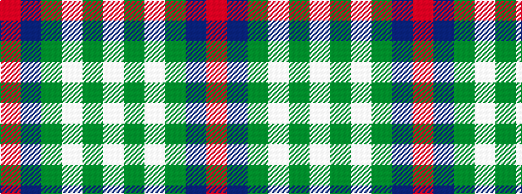

RBGWGW

It is a 6 stripe tartan.

<figure class="pat-woven">

<figcaption>idealised sample</figcaption>
</figure>

## Colour Sequence



## Tartans with this colour sequence

| Tartans |
|---------------|
| [Westfalia Dress (Corporate)](/variants/s6/w44dg18w6dg11dt1o4~x2/)|
||
