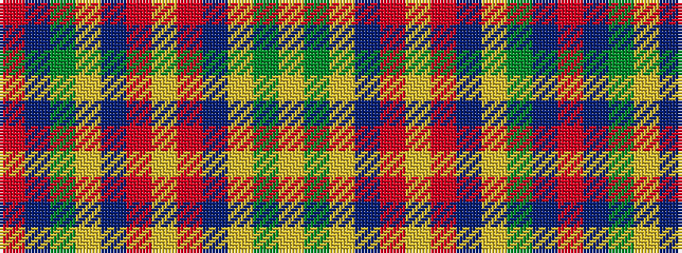

RBGYBRYRBYGY

It is a 12 stripe tartan.

<figure class="pat-woven">

<figcaption>idealised sample</figcaption>
</figure>

## Colour Sequence



## Tartans with this colour sequence

| Tartans |
|---------------|
| [Monroig, Eric (Personal)](/setts/s12/r2b2g16ly1b6r1ly1r1b6ly1g16ly2~x2/)|
||
