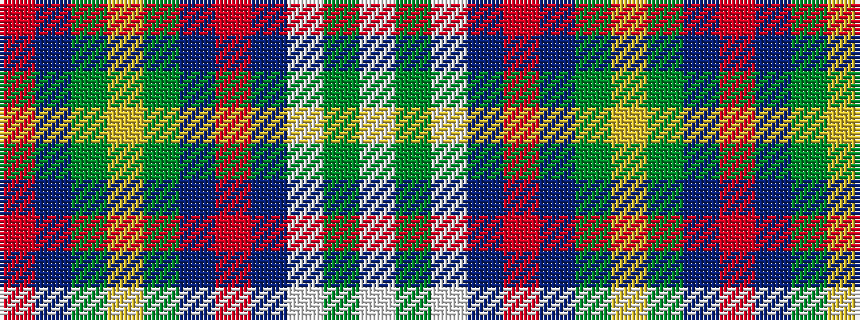

RBGYGBRBWGW

It is a 11 stripe tartan.

<figure class="pat-woven">

<figcaption>idealised sample</figcaption>
</figure>

## Colour Sequence



## Tartans with this colour sequence

| Tartans |
|---------------|
| [Kremlin Zoria](/variants/s11/w5g2w5db5r2db5g11ly2g11db5r2~x4/)|
||
