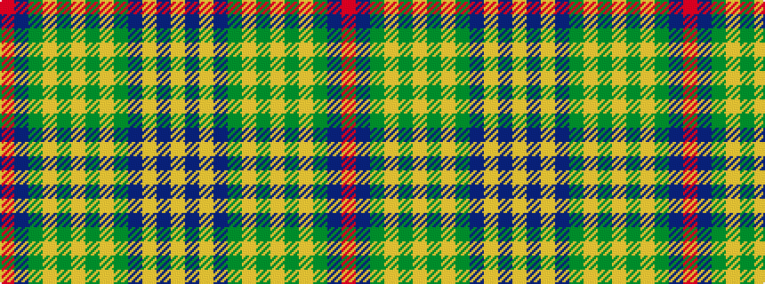

RBGYGYGYGBYBY

It is a 13 stripe tartan.

<figure class="pat-woven">

<figcaption>idealised sample</figcaption>
</figure>

## Colour Sequence



## Tartans with this colour sequence

| Tartans |
|---------------|
| [Man, Isle of](/variants/s13/r2db22dy4lr3dg7ly2dg4lr2dg9dp6ly2dp4lr2~x2/)|
||
