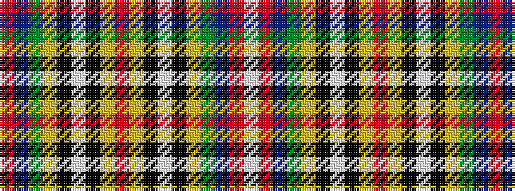

RBGYKWKYRYKWKYGBRW

It is a 18 stripe tartan.

<figure class="pat-woven">

<figcaption>idealised sample</figcaption>
</figure>

## Colour Sequence



## Tartans with this colour sequence

| Tartans |
|---------------|
| [Westwood](/setts/s18/r6t4dg16lo2k1w6k1lo30r15lo30k1w6k1lo2dg16t4r6w1~x2/)|
||
