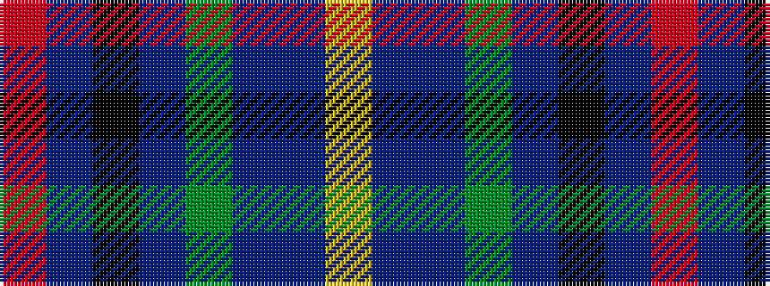

RBKBGBBY

It is a 8 stripe tartan.

<figure class="pat-woven">

<figcaption>idealised sample</figcaption>
</figure>

## Colour Sequence



## Tartans with this colour sequence

| Tartans |
|---------------|
| [Los Angeles](/setts/s8/ly4db24t5g2db3k5t33r2~x2/)|
||
