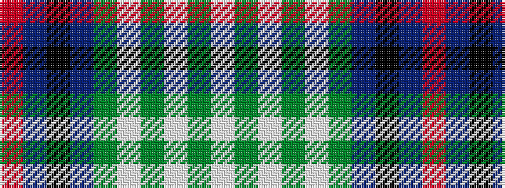

RBKBGWGWGW

It is a 10 stripe tartan.

<figure class="pat-woven">

<figcaption>idealised sample</figcaption>
</figure>

## Colour Sequence



## Tartans with this colour sequence

| Tartans |
|---------------|
| [Windsor](/variants/s10/r4n12k18n4y22lb1y2lb2y3lb2~x4/)|
||
