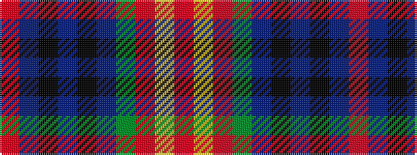

RBKBKBGRYR

It is a 10 stripe tartan.

<figure class="pat-woven">

<figcaption>idealised sample</figcaption>
</figure>

## Colour Sequence



## Tartans with this colour sequence

| Tartans |
|---------------|
| [MacEdward](/setts/s10/r6ly1r24g6db2k1db2k1db12r1~x2/)|
||
| [MacEdward (MacGregor Hastie)](/setts/s10/r6lo1r24dg6db2k1db2k1db12r1~x2/)|
||
