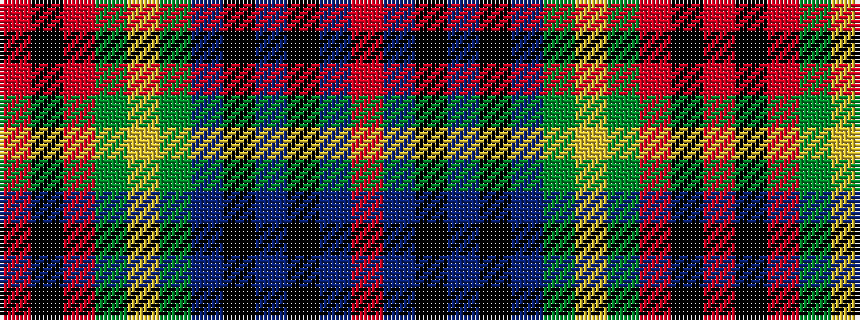

RBKBKBGYGRKR

It is a 12 stripe tartan.

<figure class="pat-woven">

<figcaption>idealised sample</figcaption>
</figure>

## Colour Sequence



## Tartans with this colour sequence

| Tartans |
|---------------|
| [Highland Spring (1985)](/setts/s12/r16k2r9g12lo2g10b3k2b3k2b3r10~x2/)|
||
