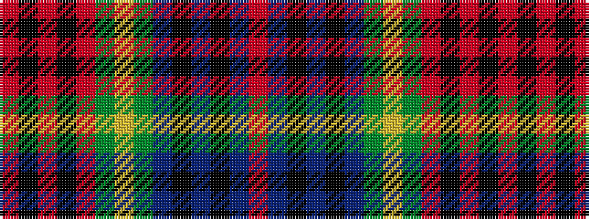

RBKBKBGYGRKRKR

It is a 14 stripe tartan.

<figure class="pat-woven">

<figcaption>idealised sample</figcaption>
</figure>

## Colour Sequence



## Tartans with this colour sequence

| Tartans |
|---------------|
| [Hay Gray (Personal)](/setts/s14/o18k2o2k2o9g10ly2g10dp11k9dp2k2dp1r3~x2/)|
||
