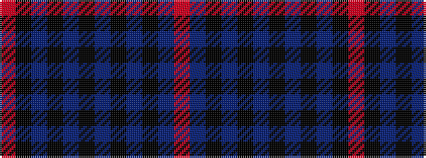

RBKBKBKBKBKR

It is a 12 stripe tartan.

<figure class="pat-woven">

<figcaption>idealised sample</figcaption>
</figure>

## Colour Sequence



## Tartans with this colour sequence

| Tartans |
|---------------|
| [MacInnes Homecoming](/variants/s12/r3do23k3db3k3do18k2do2k2do2k19o3~x2/)|
||
