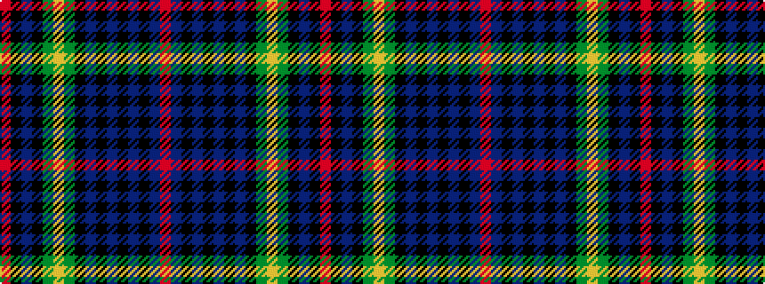

RBKBKBKBKGYGKBKR

It is a 16 stripe tartan.

<figure class="pat-woven">

<figcaption>idealised sample</figcaption>
</figure>

## Colour Sequence



## Tartans with this colour sequence

| Tartans |
|---------------|
| [Farquharson](/variants/s16/r4k2db16k16g16ly4g16k16db1k1db1k1db1k1db8r2~x2/)|
||
