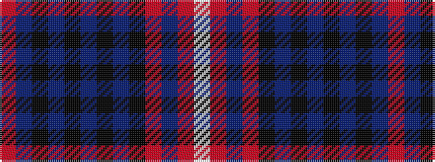

RBKBKBKBKRBRW

It is a 13 stripe tartan.

<figure class="pat-woven">

<figcaption>idealised sample</figcaption>
</figure>

## Colour Sequence



## Tartans with this colour sequence

| Tartans |
|---------------|
| [Hynett, William (Personal)](/variants/s13/rii1dt14k10dt10k1dt2k1dt10k10ri8dt2r2w1~x2/)|
||
