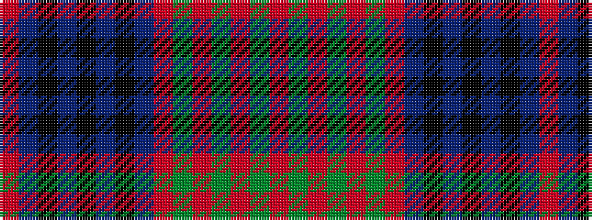

RBKBKBKBRGRGRGR

It is a 15 stripe tartan.

<figure class="pat-woven">

<figcaption>idealised sample</figcaption>
</figure>

## Colour Sequence



## Tartans with this colour sequence

| Tartans |
|---------------|
| [Homecoming (Fashion)](/setts/s15/o2dt14k3dt3k3dt3k15dt4o2dy2o2dy11o2dy2o2~x2/)|
||
