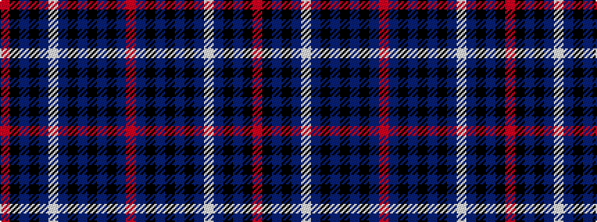

RBKBKBKBWBKBKR

It is a 14 stripe tartan.

<figure class="pat-woven">

<figcaption>idealised sample</figcaption>
</figure>

## Colour Sequence



## Tartans with this colour sequence

| Tartans |
|---------------|
| [McCaig (2016)](/variants/s14/r4t11k4t4k4t4k21db21w4db21k21t20k1r4~x2/)|
||
