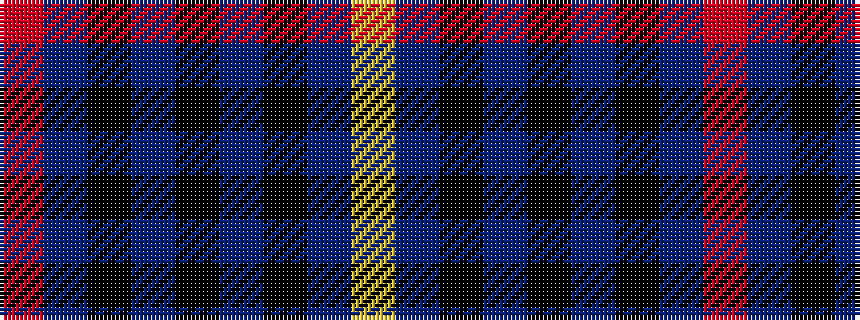

RBKBKBKBY

It is a 9 stripe tartan.

<figure class="pat-woven">

<figcaption>idealised sample</figcaption>
</figure>

## Colour Sequence



## Tartans with this colour sequence

| Tartans |
|---------------|
| [Modowny](/setts/s9/r1n6k1n1k2n1k1n6ly1~x8/)|
||
